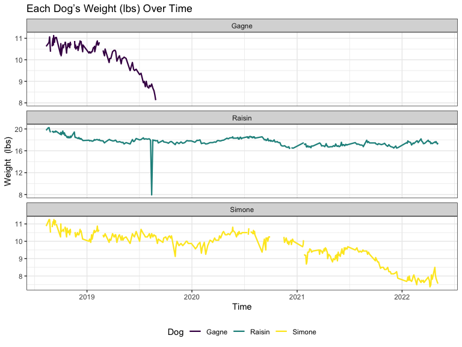
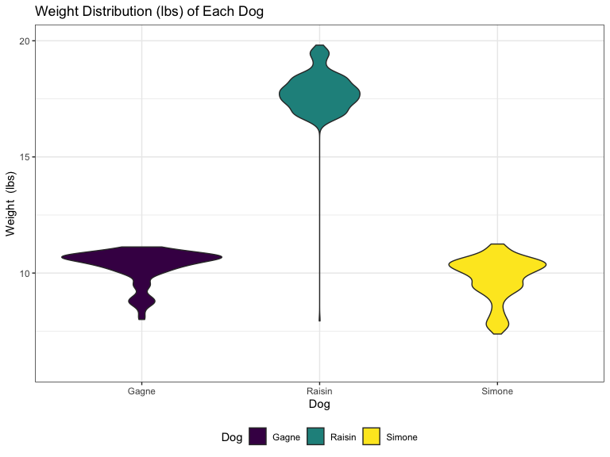
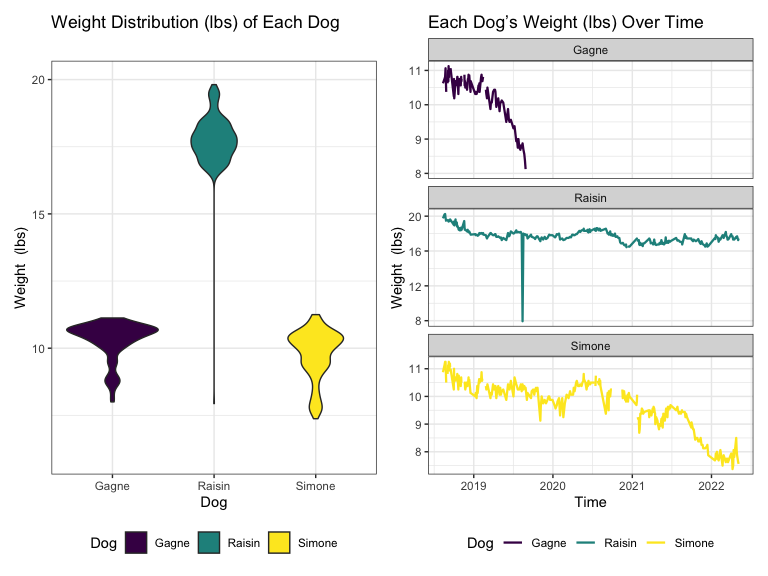

p8105_mtp_jy3269
================
Jingyi Yao
2022-10-24

| Method          | koRpus      | stringi       |
|:----------------|:------------|:--------------|
| Word count      | 500         | 464           |
| Character count | 2856        | 2856          |
| Sentence count  | 46          | Not available |
| Reading time    | 2.5 minutes | 2.3 minutes   |

## Data

**Introduction:**

-   The data records 3 pet dogs’ weight from 12-Aug-18 to 6-May-22.

-   It has 362 rows and 6 columns.

-   The first column is the date.

-   The next 3 columns show the weight of each dog, named Raisin, Simone
    and Gagne respectively.

-   A standard object is also weighed occasionally as a reference.

-   The last column contains occasional notes for the dogs’ status.

**Goals of the Report:**

-   Show the major steps in turning the raw data set into a tidy one
-   Explore the features in the 3 dogs’ weight and try to interpret them
-   Visualize the distribution of dogs’ weights and identify their
    variation over time

### I. Weight

#### 1: Incorrect column names

The column names are not correct in `raw_data`.

    ## New names:
    ## • `` -> `...2`
    ## • `` -> `...3`
    ## • `` -> `...4`
    ## • `` -> `...5`

    ## # A tibble: 6 × 5
    ##   `Weight (Lbs Oz)` ...2   ...3   ...4  ...5   
    ##   <chr>             <chr>  <chr>  <chr> <chr>  
    ## 1 DATE              Raisin Simone Gagne std    
    ## 2 43324             19 12  10 14  10 10 <NA>   
    ## 3 43331             20 03  11 02  10 12 20 15.8
    ## 4 43334             20 04  11 04  10 13 20 15.6
    ## 5 43336             19 13  11 04  11 01 20 15.6
    ## 6 43339             19 06  10 08  10 06 20 15.6

Extract the first row as column names to rename it. Then, remove the
first row to avoid duplication.

``` r
weight = raw_data             # save the raw data and work on the new data set named weight 

colnames(weight) = weight[1,] # change column names

weight <- weight[-1,]         # omit the first row which is the column name

head(weight)                  # data after column name correction
```

    ## # A tibble: 6 × 5
    ##   DATE  Raisin Simone Gagne std    
    ##   <chr> <chr>  <chr>  <chr> <chr>  
    ## 1 43324 19 12  10 14  10 10 <NA>   
    ## 2 43331 20 03  11 02  10 12 20 15.8
    ## 3 43334 20 04  11 04  10 13 20 15.6
    ## 4 43336 19 13  11 04  11 01 20 15.6
    ## 5 43339 19 06  10 08  10 06 20 15.6
    ## 6 43340 <NA>   <NA>   <NA>  <NA>

#### 2: Unify Units

The original units contain both lbs and oz. First, the two units are
separated. According to 1 lb = 16 oz, oz is transformed into lb and then
added to the lbs column. Now we have the weight measured in lbs.

``` r
weight <- weight %>% 
  separate(Raisin, c("Raisin (Lbs)","Raisin (Oz)"), sep = " ", convert = TRUE) %>% 
  separate(Simone, c("Simone (Lbs)","Simone (Oz)"), sep = " ", convert = TRUE) %>% 
  separate(Gagne, c("Gagne (Lbs)","Gagne (Oz)"), sep = " ", convert = TRUE) %>% 
  separate(std, c("std (Lbs)","std (Oz)"), sep = " ", convert = TRUE) %>% 
  janitor::clean_names() %>% 
  mutate(Raisin = raisin_lbs + raisin_oz/16,   # 1 lb = 16 oz
         Simone = simone_lbs + simone_oz/16,
         Gagne = gagne_lbs + gagne_oz/16,
         Standard = std_lbs + std_oz/16
          ) %>% 
  select(date,Raisin,Simone,Gagne,Standard)
```

``` r
head(weight)     # data after units transformation
```

    ## # A tibble: 6 × 5
    ##   date  Raisin Simone Gagne Standard
    ##   <chr>  <dbl>  <dbl> <dbl>    <dbl>
    ## 1 43324   19.8   10.9  10.6     NA  
    ## 2 43331   20.2   11.1  10.8     21.0
    ## 3 43334   20.2   11.2  10.8     21.0
    ## 4 43336   19.8   11.2  11.1     21.0
    ## 5 43339   19.4   10.5  10.4     21.0
    ## 6 43340   NA     NA    NA       NA

#### 3: Messy date

1.  The dates from excel are shown as integers but in character type
    in R. First, transform it into numeric type. Then add the number to
    the original date of `1899-12-30` to get the actual date

2.  Wrong date When examining the unique values of dates,there is an `s`
    in the date column. We suppose that this is a wrong entry due to
    mistyping. We locate it and use the middle day of the 2 dates next
    to it to correct it

``` r
unique(weight$date)                # find outliers in date

which(weight$date == "s")          # locate the outlier
```

``` r
weight <- weight %>% 
  mutate(date = as.numeric(date))  # transform data type and the “s” will be NA

# use the middle day between the 76th and 78th day.
weight$date[is.na(weight$date)] <- round(((weight$date)[78] + (weight$date)[76])/2)
```

``` r
# change the numbers into date format
weight <- weight %>% 
  mutate(date = as.Date(weight$date, origin = "1899-12-30"))

write_csv(weight,file = "data/weight.csv")

# another data set to store the date in a separated way
weight_1 <- weight %>%  
  separate(date, into = c("Year","Month","Day"),sep = "-") %>% 
  mutate(Month = month.abb[as.numeric(Month)])
```

``` r
head(weight)    # data after date correction
```

    ## # A tibble: 6 × 5
    ##   date       Raisin Simone Gagne Standard
    ##   <date>      <dbl>  <dbl> <dbl>    <dbl>
    ## 1 2018-08-12   19.8   10.9  10.6     NA  
    ## 2 2018-08-19   20.2   11.1  10.8     21.0
    ## 3 2018-08-22   20.2   11.2  10.8     21.0
    ## 4 2018-08-24   19.8   11.2  11.1     21.0
    ## 5 2018-08-27   19.4   10.5  10.4     21.0
    ## 6 2018-08-28   NA     NA    NA       NA

#### 4. Wrong Weight

When examine the unique values of weights, we find wrong entry like
`1810` instead of `18 10`.

``` r
weight$Raisin[40] <- 18 + 10/16
weight$Raisin[117] <- 18 + 3/16
weight$Raisin[210] <- 17 + 15/16
weight$Standard[358] <- 20 + 15.4/16
```

#### 5. Tidy data

Transform columns of weight into 2 new columns named `Dog` and `Weight`.

``` r
weight_2 <- weight %>% 
  pivot_longer(                          
    Raisin:Standard,
    names_to = "Dog", 
    values_to = "Weight") %>% 
  mutate(
    Dog = factor(Dog),
  )

weight_2
```

    ## # A tibble: 1,444 × 3
    ##    date       Dog      Weight
    ##    <date>     <fct>     <dbl>
    ##  1 2018-08-12 Raisin     19.8
    ##  2 2018-08-12 Simone     10.9
    ##  3 2018-08-12 Gagne      10.6
    ##  4 2018-08-12 Standard   NA  
    ##  5 2018-08-19 Raisin     20.2
    ##  6 2018-08-19 Simone     11.1
    ##  7 2018-08-19 Gagne      10.8
    ##  8 2018-08-19 Standard   21.0
    ##  9 2018-08-22 Raisin     20.2
    ## 10 2018-08-22 Simone     11.2
    ## # … with 1,434 more rows

### II. Notes

Extract last column and bind with the date

``` r
raw_data_note <- read_excel("./data/dogweights_07may2022.xlsx",range = "G2:G363") 
```

    ## New names:
    ## • `` -> `...1`

``` r
raw_data_note
```

    ## # A tibble: 361 × 1
    ##    ...1                                     
    ##    <chr>                                    
    ##  1 <NA>                                     
    ##  2 <NA>                                     
    ##  3 <NA>                                     
    ##  4 <NA>                                     
    ##  5 Right after leaving for 3 days at Weber's
    ##  6 <NA>                                     
    ##  7 <NA>                                     
    ##  8 <NA>                                     
    ##  9 <NA>                                     
    ## 10 <NA>                                     
    ## # … with 351 more rows

``` r
date <- weight[,1] # use the date in the weight dataframe
date
```

    ## # A tibble: 361 × 1
    ##    date      
    ##    <date>    
    ##  1 2018-08-12
    ##  2 2018-08-19
    ##  3 2018-08-22
    ##  4 2018-08-24
    ##  5 2018-08-27
    ##  6 2018-08-28
    ##  7 2018-08-29
    ##  8 2018-08-30
    ##  9 2018-08-31
    ## 10 2018-09-01
    ## # … with 351 more rows

``` r
note <- bind_cols(date,raw_data_note)
```

    ## New names:
    ## • `...1` -> `...2`

``` r
colnames(note)[2] <- "Notes"

note
```

    ## # A tibble: 361 × 2
    ##    date       Notes                                    
    ##    <date>     <chr>                                    
    ##  1 2018-08-12 <NA>                                     
    ##  2 2018-08-19 <NA>                                     
    ##  3 2018-08-22 <NA>                                     
    ##  4 2018-08-24 <NA>                                     
    ##  5 2018-08-27 Right after leaving for 3 days at Weber's
    ##  6 2018-08-28 <NA>                                     
    ##  7 2018-08-29 <NA>                                     
    ##  8 2018-08-30 <NA>                                     
    ##  9 2018-08-31 <NA>                                     
    ## 10 2018-09-01 <NA>                                     
    ## # … with 351 more rows

``` r
write_csv(note,file = "data/note.csv")
```

## EDA

#### 1.unique dates

361 unique dates.

#### 2. Table

-   `avg_weight` measures the average weight. Simone is the lightest and
    Raisin is the heaviest.
-   `sd_weight` measures the deviation from the average weight. The
    deviations are all small ,showing low variability in weight.
    Variability of Raisin and Simone are slightly higher.
-   `num_obs` counts the non-NA observations.

``` r
weight_2 %>% 
  group_by(Dog) %>% 
  summarize(
    avg_weight = round(mean(Weight,na.rm = T),digits = 3),   # NA is removed
    sd_weight = round(sd(Weight,na.rm = T),digits = 3),
    num_obs = sum(!is.na(Weight))                            # count non-NA obs
  ) %>% 
  knitr::kable(caption = "Number of Observations and Weight Features")
```

| Dog      | avg_weight | sd_weight | num_obs |
|:---------|-----------:|----------:|--------:|
| Gagne    |     10.295 |     0.706 |     120 |
| Raisin   |     17.786 |     0.934 |     356 |
| Simone   |      9.791 |     0.916 |     334 |
| Standard |     20.976 |     0.010 |      46 |

Number of Observations and Weight Features

## Visualization

``` r
weight_lbs_over_time <- weight_2 %>% 
  filter(Dog != "Standard") %>% 
  ggplot(aes(x = date, y = Weight,color = Dog), group = Dog) +
  geom_line(size = 0.8) + facet_wrap(.~Dog, nrow=3,scales = "free_y")+
  labs(x = "Time",
       y = "Weight  (lbs)",
       title = "Each Dog’s Weight (lbs) Over Time") +
  theme_bw() +
  theme(legend.position = "bottom")

weight_lbs_over_time
```



-   Gagne’s observations ended in 2019 because it died on 09/08/2019
-   A sudden drop in Raisin’s weight is on 08/14/2019. The value
    recorded is 7lbs 15oz, while the weight on 08/10/2019 is 17lbs 15oz.
    Thus, this outlier is probably caused by mistyping.
-   The interrupted connections are due to no records. Most of the
    missing records are due to that dogs are at the kennels.
-   The overall trends of Gagne and Simone are decreasing while Raisin
    has a more stabilized trend excluding the outlier.

``` r
weight_distribution_lbs<- weight_2 %>% 
  filter(Dog != "Standard") %>%
  ggplot(aes(x = Dog, y = Weight,fill = Dog)) +
  geom_violin() +
  scale_y_continuous(
    limits = c(6,20)) +
  labs(x = "Dog",
       y = "Weight  (lbs)",
       title = "Weight Distribution (lbs) of Each Dog") +
  theme_bw() +
  theme(legend.position = "bottom")
  

weight_distribution_lbs
```



-   Gagne and Simone have similar distribution, ranging from 5 to 12
    lbs. And most of the observations concentrate around 11 lbs.
-   Raisin’s weights mostly concentrate around 18 lbs. And the lower
    range of 7 lbs could be the outlier caused by mistyping.

``` r
weight_distribution_lbs + weight_lbs_over_time
```


